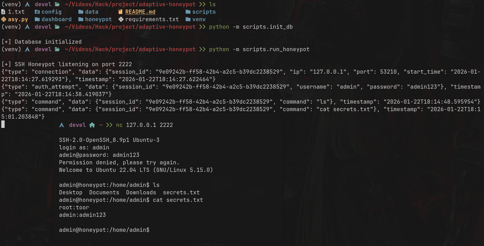
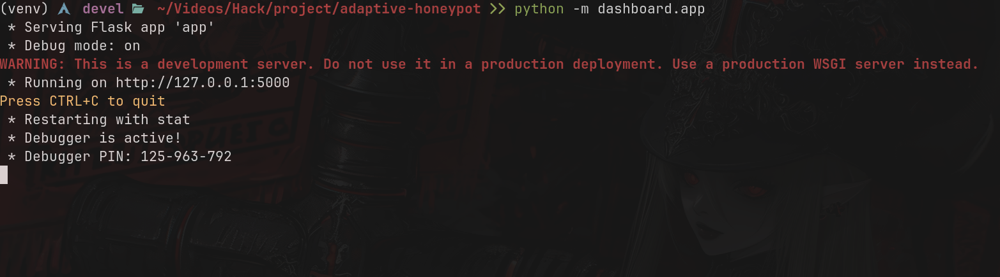
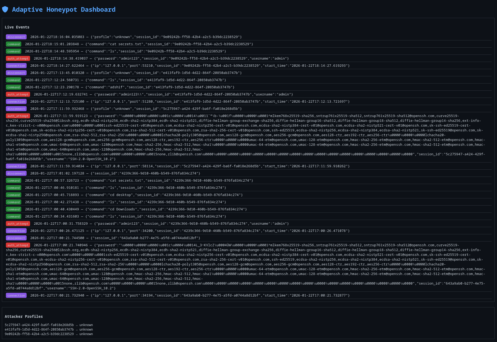

# Adaptive Honeypot That Learns Attack Patterns Live

⚠️ Research & defensive security only.

An async, Python-based adaptive honeypot that observes, learns, and dynamically deceives attackers.

Built for:
- Security research
- Hackathons
- Learning adversarial behavior


# 🛡️ Adaptive Honeypot Architecture

This project is an **event-driven, asynchronous honeypot platform** designed for cybersecurity research and hackathon demonstrations.  
It emulates real services, observes attacker behavior, learns patterns in real time, and dynamically adapts its deception strategies.

---

## 🧠 1. High-Level Architecture (Simple but Technical)

At a high level, the system is composed of multiple **loosely coupled layers**, each responsible for a specific security function.

### 🔹 Core Layers Overview

---

### 🌐 Network Deception Layer
- Fake services implemented using **asyncio**
- Supported protocols:
  - SSH
  - HTTP
  - FTP
- Mimics real protocol behavior to attract attackers
- **Never executes real commands**
- Completely isolated from the host OS

---

### 👁️ Observation & Telemetry Layer
Captures detailed attacker activity, including:
- Source IP and port
- Timestamps
- Commands / payloads
- Request sequences
- Timing between actions

All data is emitted as **structured JSON events** for consistency and analysis.

---

### 💾 Persistence Layer
- Lightweight **SQLite** database
- Append-only design (for forensic integrity)
- Optimized for **read-heavy analytics**
- Stores both raw events and extracted features

---

### 🤖 Learning Layer (ML / Behavior Engine)
- Consumes historical and live attack data
- Extracts behavioral features
- Performs:
  - Clustering
  - Anomaly detection
- Generates attacker **behavior profiles**

---

### 🎭 Adaptive Response Engine
Uses learned behavior profiles to dynamically:
- Change service banners
- Introduce artificial delays
- Inject fake errors
- Modify virtual filesystem views
- Escalate deception depth over time

The goal is to **confuse attackers while gathering intelligence**.

---

### 📊 Visualization & Control Layer
- Flask-based web dashboard
- Read-only interface for safety
- Provides:
  - Live attack feed
  - Pattern summaries
  - Behavior evolution over time

---


## 📁 Project Structure

The repository is organized to ensure **modularity**, **clarity**, and **long-term extensibility**.

```text
adaptive-honeypot/
├── README.md
├── pyproject.toml / requirements.txt
├── config/
│   ├── global.yaml
│   ├── services.yaml
│   ├── logging.yaml
│   └── ml.yaml
│
├── honeypot/
│   ├── __init__.py
│   │
│   ├── core/
│   │   ├── __init__.py
│   │   ├── server.py
│   │   ├── session.py
│   │   ├── events.py
│   │   └── config.py
│   │
│   ├── services/
│   │   ├── __init__.py
│   │   ├── base.py
│   │   ├── ssh.py
│   │   ├── http.py
│   │   └── ftp.py
│   │
│   ├── logging/
│   │   ├── __init__.py
│   │   ├── logger.py
│   │   └── formatter.py
│   │
│   ├── storage/
│   │   ├── __init__.py
│   │   ├── database.py
│   │   └── models.py
│   │
│   ├── ml/
│   │   ├── __init__.py
│   │   ├── features.py
│   │   ├── clustering.py
│   │   └── profiles.py
│   │
│   ├── adapt/
│   │   ├── __init__.py
│   │   ├── engine.py
│   │   └── strategies.py
│   │
│   └── utils/
│       ├── __init__.py
│       ├── timing.py
│       └── net.py
│
├── dashboard/
│   ├── app.py
│   ├── routes.py
│   ├── templates/
│   │   └── index.html
│   └── static/
│       ├── css/
│       └── js/
│
├── scripts/
│   ├── run_honeypot.py
│   └── init_db.py
│
└── data/
    ├── honeypot.db
    └── logs/
```


## 🧩 2. Responsibility of Each Major Module

---

### ⚙️ `config/`
- Centralized configuration directory
- No hardcoded ports, banners, delays, or thresholds
- YAML chosen for readability and safety
- All runtime behavior is config-driven

---

### 🧠 `honeypot/core/`
The **backbone of the system**.

#### `server.py`
- Async entry point
- Starts all enabled services
- Handles graceful shutdown

#### `session.py`
Represents a single attacker connection.
Tracks:
- `session_id`
- Source IP and port
- Timestamps
- Behavior counters

#### `events.py`
Defines canonical event types, such as:
- `AUTH_ATTEMPT`
- `COMMAND_EXEC`
- `HTTP_REQUEST`

#### `config.py`
- Loads and validates YAML configs
- Provides centralized config access

---

### 🌐 `honeypot/services/`
Protocol-specific deception logic.

#### `base.py`
Abstract service interface enforcing:
- `start()`
- `handle_client()`
- `emit_event()`

#### `ssh.py`
- Fake SSH handshake
- Simulated authentication
- Command capture (no execution)

#### `http.py`
- Fake HTTP endpoints
- Mimics real frameworks and servers

#### `ftp.py`
- Fake login flow
- Fake directory listings

Each service is **plug-and-play**.

---

### 📜 `honeypot/logging/`
Structured, security-grade logging.

#### `logger.py`
- Central async logger
- Writes structured JSON logs
- Forwards events to database

#### `formatter.py`
- Normalizes event schema
- Guarantees consistency across services

---

### 💾 `honeypot/storage/`
Persistence layer.

#### `database.py`
- SQLite connection
- WAL mode enabled
- Safe concurrent access

#### `models.py`
Database tables:
- `sessions`
- `events`
- `features`
- `profiles`

---

### 🤖 `honeypot/ml/`
Learning and intelligence layer.

#### `features.py`
- Converts raw events into numeric features
- Stateless and deterministic

#### `clustering.py`
- ML logic (e.g., DBSCAN, KMeans)
- Runs periodically or on demand

#### `profiles.py`
- Maps clusters to attacker types
- Profiles are stored and reused

---

### 🎭 `honeypot/adapt/`
Where intelligence turns into deception.

#### `engine.py`
- Core decision engine
- Inputs:
  - Session state
  - ML behavior profile
- Outputs:
  - Selected response strategy

#### `strategies.py`
Reusable deception behaviors, such as:
- `slow_responder`
- `fake_fs`
- `banner_mutation`

---
### 🔐 Fake SSH Session




### 📊 `dashboard/`
Read-only visualization layer.

#### `app.py`
- Flask application factory

### 📊 Live Dashboard



#### `routes.py`
- REST API endpoints

#### `templates/`
- Minimal HTML templates

#### `static/`
- JavaScript for polling and charts

### 📊 Live Dashboard




> The dashboard never interacts directly with honeypot internals.

---

### 🛠️ `scripts/`
Operational helpers:
- `run_honeypot.py` — start the honeypot
- `init_db.py` — initialize database schema

---


## 🗺️ 3. Text-Based Architecture Diagram

```text
                ┌────────────────────┐
                │     Attacker        │
                │ (SSH / HTTP / FTP)  │
                └─────────┬──────────┘
                          │
                          ▼
        ┌─────────────────────────────────┐
        │      Async Honeypot Services     │
        │ ┌────────┐ ┌────────┐ ┌──────┐ │
        │ │  SSH   │ │ HTTP   │ │ FTP  │ │
        │ └────────┘ └────────┘ └──────┘ │
        └─────────┬──────────────────────┘
                  │ (events)
                  ▼
        ┌─────────────────────────────────┐
        │ Structured Event Logger (JSON)   │
        └─────────┬──────────────────────┘
                  │
                  ▼
        ┌─────────────────────────────────┐
        │        SQLite Database           │
        │  - sessions                     │
        │  - commands                     │
        │  - requests                     │
        │  - behavior_features            │
        └─────────┬──────────────────────┘
                  │
                  ▼
        ┌─────────────────────────────────┐
        │     ML / Behavior Analyzer       │
        │  - clustering                   │
        │  - anomaly detection            │
        └─────────┬──────────────────────┘
                  │ (profiles)
                  ▼
        ┌─────────────────────────────────┐
        │ Adaptive Response Engine         │
        │  - deception strategy            │
        │  - protocol mutation             │
        └─────────┬──────────────────────┘
                  │
                  ▼
        ┌─────────────────────────────────┐
        │ Flask Dashboard (Read-only)      │
        │  - live feed                     │
        │  - charts                        │
        │  - behavior clusters             │
        └─────────────────────────────────┘

```

## 🔐 6. How Real SSH Attacks Behave (Why This Design Matters)

Understanding **real-world attacker behavior** is critical to building an effective honeypot.

### 🧠 Typical SSH Attack Pattern
Most automated tools and human attackers follow a predictable flow:

1. Connect to the target SSH service  
2. Read the SSH banner  
3. Attempt username/password authentication  
4. If authentication appears successful:
   - Send shell commands
   - Enumerate the system  
     - `uname -a`
     - `ls`
     - `cat /etc/passwd`

This honeypot simulates **just enough of this behavior** to appear real while remaining completely safe.

---

## ⚙️ 6.1 Core Design Choices (SSH Honeypot)

The SSH honeypot is intentionally **minimal, controlled, and deceptive**.

| Area        | Decision                                   |
|-------------|---------------------------------------------|
| Protocol    | Raw TCP (not a real SSH implementation)     |
| Port        | `2222` (safe, non-privileged default)       |
| Banner      | Configurable OpenSSH-style banner           |
| Auth        | Always fails **or** fake-success (config)   |
| Shell       | Text-based fake shell                       |
| Commands    | Logged only, never executed                 |
| Responses   | Static initially, adaptive over time        |

This approach avoids complexity while still capturing **valuable attacker behavior**.

---

## 🔄 6.2 Fake SSH Interaction Flow

The SSH honeypot follows a realistic but fully simulated interaction flow:

```text
Client connects
        ↓
Send SSH banner
        ↓
Prompt for username
        ↓
Prompt for password
        ↓
Log credentials
        ↓
Fake authentication result
        ↓
If fake-success:
    ├── Present fake shell prompt
    ├── Log every command entered
    └── Respond with fake command output
```

# 🚀 Installation & Quick Start

> ⚠️ Run locally for research and learning only.

---

## 📥 1. Clone the Repository
```bash
git clone https://github.com/0xhroot/adaptive-honeypot.git
cd adaptive-honeypot
```

## 🧪 2. Create & Activate Virtual Environment (Required)

## Linux / macOS / WSL
```bash
python3 -m venv venv
source venv/bin/activate
```

### Windows (PowerShell)
```bash
python -m venv venv
venv\Scripts\Activate.ps1

```

### 📦 3. Install Dependencies
```bash

pip install --upgrade pip
pip install -r requirements.txt
```

### 🗄 4. Initialize Database (Run Once)
```bash

python scripts/init_db.py
```

This creates:
```bash
data/honeypot.db
```

### ▶️ 5. Start the Honeypot
```bash
python scripts/run_honeypot.py
```

### Expected output:

[+] SSH Honeypot listening on port 2222

### 🌐 6. Start the Dashboard (New Terminal)
```bash
source venv/bin/activate
python dashboard/app.py
```

Open:
```bash
http://127.0.0.1:5000
```

### 🧪 7. Test (Safe)
```bash
nc 127.0.0.1 2222
```

### Try fake commands:
```bash
ls
whoami
uname -a
```


---

## 🚀 Future Work

This project is intentionally modular and extensible.  
Possible future enhancements include:

- Additional honeypot services (SMTP, DNS, Telnet)
- More advanced ML models for behavior profiling
- Real-time adaptive deception strategies
- Threat-intelligence integration
- Long-term attacker behavior correlation

The goal is to evolve this into a **research-grade adaptive deception platform**.

Contributions and ideas are welcome.


---

## 🧠 Final Notes

This project is intentionally designed as a **defensive security research tool**.  
It focuses on **observation, behavior analysis, and deception**, not exploitation.

- No real services are exposed
- No attacker commands are executed
- No outbound scanning or retaliation occurs

If you use or extend this project, **do so responsibly** and within legal boundaries.

---

## ⚖️ Ethical Use Disclaimer

This repository is provided **for educational, research, and hackathon purposes only**.

Any misuse, including deploying this system against real targets without authorization,
is **strictly discouraged**.  
The author assumes **no responsibility** for improper or illegal usage.

Use knowledge to **defend systems, not harm them**.

